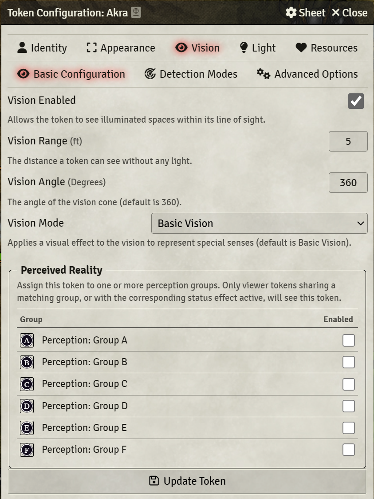
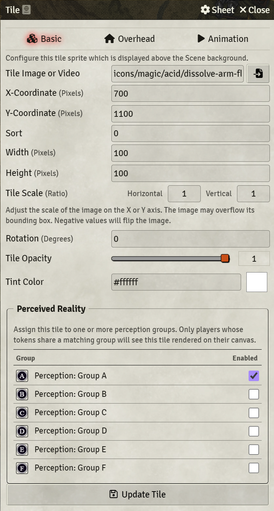
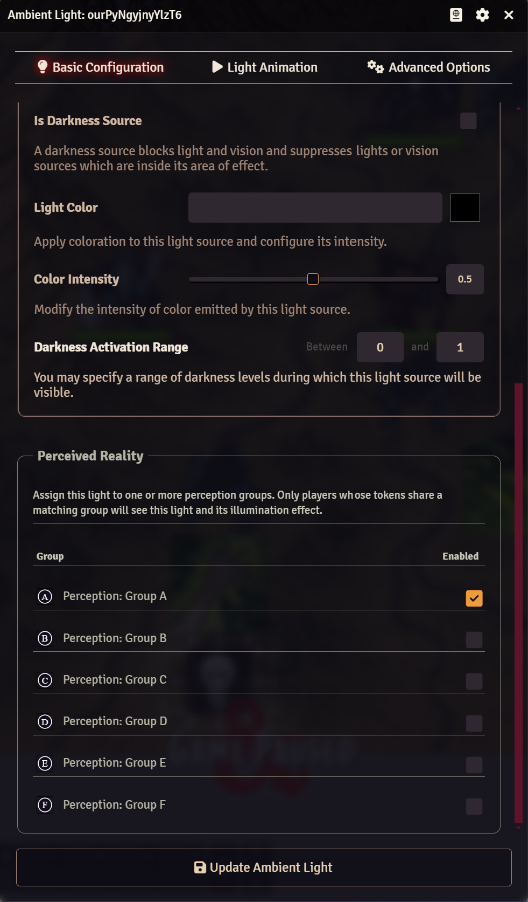
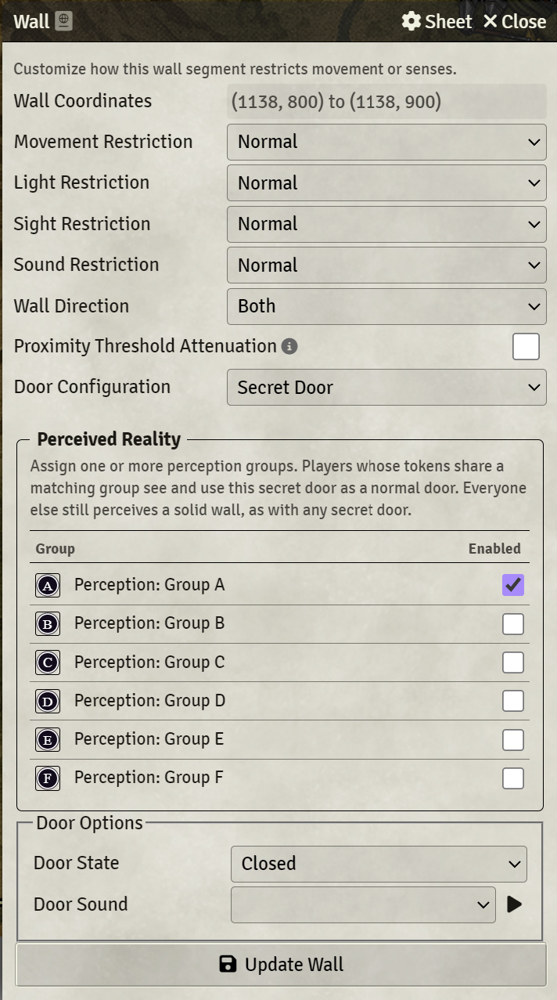
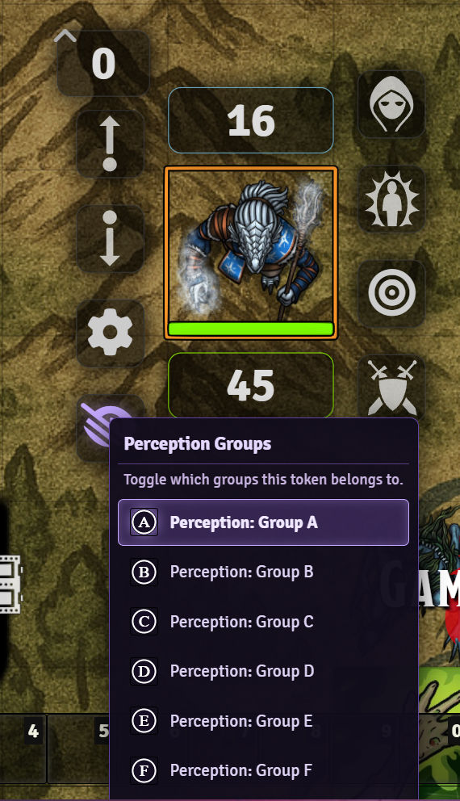
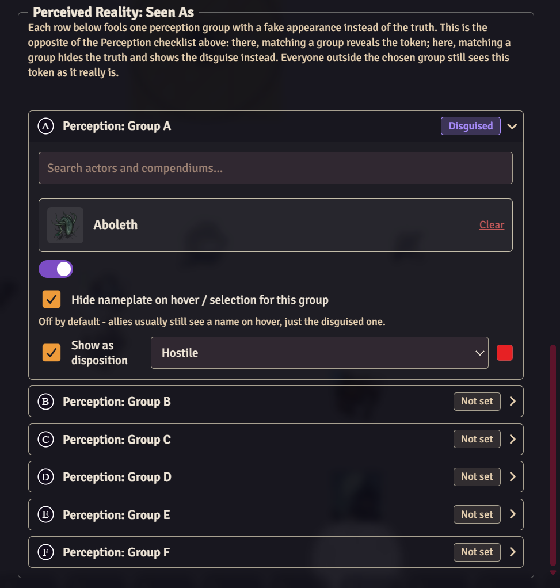
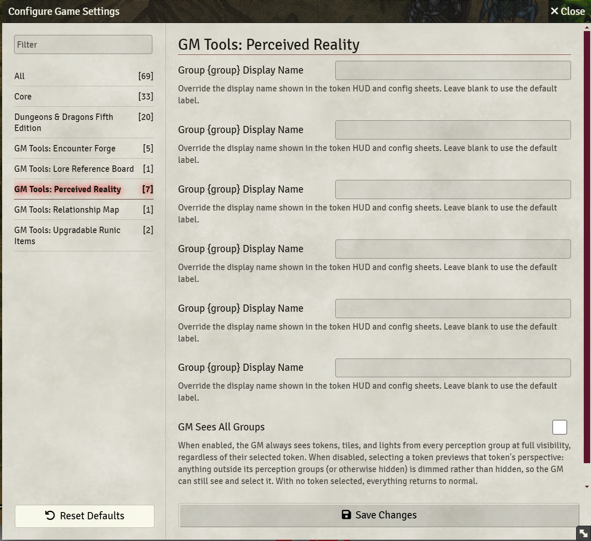
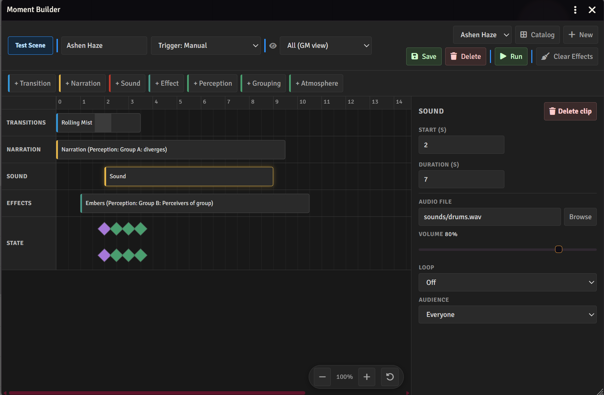
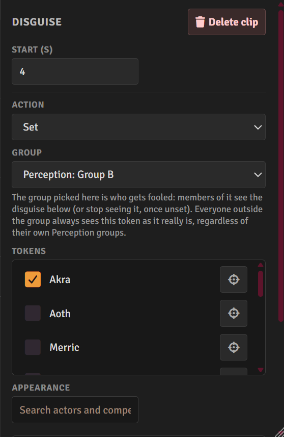

# GM Tools: Perceived Reality

[](https://patreon.com/Elemor)
[](https://foundryvtt.com)
[](https://github.com/ElemorSeru/perceived-reality/releases/latest)


A Foundry VTT module that lets the GM assign tokens, tiles, lights, and doors to **perception groups**. Only the players whose characters belong to a matching group can see (or use) those objects, while everyone else perceives the canvas as if they were never there. Built for hallucinations, illusions, invisible creatures, hidden passages, and any other "not everyone sees the same thing" moment, all on the same shared scene.

On top of that, the **Moment Builder** lets the GM script out full sequences, transitions, narration, sound, perception changes, atmosphere shifts, even FXMaster weather, on a multi-row timeline, save them, and trigger them on demand or automatically when a scene goes live.

---

## History / Reasoning

A lot of the best horror and mystery moments at the table come from players not being on the same page about what's actually in the room. A charmed PC sees their friend as a monster. A character under a hallucination spell sees a perfectly safe hallway, while everyone else sees the pit trap in front of them. A rogue spots a hidden door that the rest of the party walks right past.

Foundry doesn't really have a clean way to do this without duplicating scenes, juggling multiple maps, or relying on the players' honesty. Perceived Reality grew out of wanting that "split reality" moment to just work on one shared canvas: tag the things that should only be visible to certain players, tag the players (or apply a status effect) so they're in that group, and the canvas updates live for everyone without anyone needing to leave the scene.

The Moment Builder grew out of the same idea taken further: once the canvas can already diverge per player, why not let the GM choreograph how that divergence happens visually, timed transitions, narration, and effects that play out automatically instead of being toggled by hand mid-session and manually.

---

## Perception Groups

The module ships with six perception groups (Group A through Group F). Any object, token, tile, light, or door can be assigned to one or more of these groups from its normal configuration sheet. A new "Perceived Reality" section is added directly to the Token, Tile, Light, and Wall config windows.

Group names default to "Perception: Group A" through "Group F", but each group's display name can be overridden per-world from the module settings (handy for renaming them to something like "Cursed Sight" or "Thieves' Cant").

A token only needs to belong to **one** of an object's assigned groups to perceive it, objects can be assigned to multiple groups at once.

---

## What Can Be Hidden

### Tokens & Tiles
<p align="center">
  
  
</p>

Assign one or more perception groups to a token or tile, and only players whose characters share a matching group will see it rendered on their canvas. Everyone else's canvas behaves as if it isn't there at all, no flicker, no placeholder, no "hidden" icon for players.

### Lights
<p align="center">
  
</p>

Lights work the same way, with one extra wrinkle: a restricted light's illumination is also hidden from non-matching players, not just its control icon. To everyone outside the group, the room stays exactly as dark (or as lit by other sources) as it would be without that light.

### Walls & Doors
<p align="center">
  
</p>

Walls can be restricted too, and the behavior depends on the wall's existing Door type:

- **A regular Door** assigned to one or more groups becomes a normal, usable door for matching players, and a plain solid wall (no door icon, no opening) for everyone else.
- **A Secret Door** assigned to one or more groups is revealed as a normal door to matching players, while remaining a secret door (invisible, like any other secret door) to everyone else, including non-matching players.
- Walls with no Door type are unaffected. assigning groups to a plain wall has no effect, since there's nothing to reveal or hide.

This means a hidden passage can be "secret to the party but obvious to the rogue's player," or a corridor can "exist" for one player's hallucination while being a dead-end wall for the rest of the table.

---

## Viewer Groups: Who Can Perceive What

A token "belongs" to a perception group through its **viewer groups**, which can be set in two ways:

### Token HUD Button
<p align="center">
  
</p>

GMs get a new eye icon on the Token HUD. Clicking it opens a small panel listing all six perception groups, click any of them to toggle that token in or out of the group. This is the quickest way to permanently assign a PC (or any token) to a group, for example, giving the party rogue permanent access to a hidden-door group.

### Status Effects (Active Effects)

Each perception group also has a matching status effect that can be applied to a token through the normal status effect menu, or via spells, items, or active effects in your system. While the effect is active, that token can perceive everything assigned to that group, and it's removed the moment the effect ends.

This is the intended path for *temporary* perception changes, true seeing, a hallucination spell wearing off, a potion of invisibility detection, and so on, without permanently editing the token.

---

## Disguises: Showing Something Else
<p align="center">
  
</p>

Perception groups remove things from a player's canvas. Disguises do the opposite: instead of hiding a token, they replace what the group sees with a different appearance.

Open a token's configuration sheet and find the **Perceived Reality: Seen As** section, below the perception checklist. Each of the six groups gets its own row, and each row can give that token a separate fake appearance.

The logic is the mirror image of the checklist above it. There, matching a group *reveals* the token. Here, matching a group *replaces* it, and everyone outside that group keeps seeing the token as it really is.

Each row can set:

- **Appearance** - search across the world's actors and every compendium and pick one. Its artwork becomes what that group sees, and its name replaces the nameplate.
- **Enable / disable** - a toggle that keeps the disguise configured but switches it off, so it can be dropped and restored without rebuilding it.
- **Hide nameplate** - suppress the nameplate entirely for that group instead of showing the disguised name. Off by default, since allies usually still expect a name on hover.
- **Show as disposition** - override the token's border color for that group (Hostile, Neutral, Friendly, or Secret), so a disguised ally can read as hostile to the group being fooled.

If a token carries disguises for several groups and a viewer belongs to more than one of them, the first configured group in A to F order wins.

One thing to watch: a disguise applies to everyone in the group, including the player who controls the disguised token. If a PC is in the same group their own token is disguised for, they will see their own token disguised. Keep the fooled players in a group the disguised token is not itself a member of.

Only the appearance changes. The actor, its stats, and anything mechanical are untouched, this is purely what each player's canvas draws.

### GM Sees True Appearances

A separate setting from "GM Sees All Groups". While it is on (the default), the GM always sees real appearances and ignores disguises entirely. Turn it off and selecting a token previews the canvas as that token perceives it: the selected token always shows as itself, and anything it would perceive as disguised is drawn disguised. With nothing selected, the GM sees the default disguised view.

---

## GM Tools & Preview Mode
<p align="center">
  
</p>

### GM Sees All Groups

By default, GMs always see every token, tile, light, and door at full visibility regardless of perception group, exactly as if Perceived Reality wasn't installed for them. This can be turned off in the module settings.

### Preview Mode

With "GM Sees All Groups" disabled, selecting a token on the canvas previews that token's perspective. Anything outside its perception groups isn't hidden from the GM, it's dimmed and desaturated instead, so the GM can still see, click, and manage it while getting a quick visual read on exactly what that token can and can't perceive. Deselecting the token returns the canvas to normal.

This is built for spot-checking: select the rogue's token to confirm the hidden door reads correctly, select a hallucinating PC to confirm the illusion is in place, all without affecting what players actually see.

---

## Moment Builder: Scripted Reveals & Effects
<p align="center">
  
</p>

Open it with **Ctrl+Shift+M** or from the scene sidebar's right-click menu. The Moment Builder is a multi-row timeline editor for choreographing everything the module can do, plus screen transitions, narration, and sound, into a single reusable **Moment** that plays back with one click (or automatically when a scene activates).

A Moment's timeline has clips of eight types, each snapping to a half-second grid so timing lines up without fiddling:

- **Transition** - a full screen curtain effect (mist, rain, blackout, and 17 more built-in styles), fully customizable in color, particle count, blur, and intensity.
- **Narration** - letterboxed on-screen text, optionally different text for one perception group than for everyone else.
- **Sound** - plays an audio file, targetable at everyone or just one group.
- **Effect** - an [FXMaster](https://github.com/gambit07/fxmaster) particle or filter effect (rain, snow, fog, and whatever else FXMaster provides) timed to the clip, with the option to target a single perception group instead of the whole table. Only appears if FXMaster is installed and active, see below.
- **Perception** - grants or removes a token's membership in a perception group, scripted instead of toggled by hand.
- **Grouping** - tags or untags a token, tile, light, or door with a perception group, changing who can see it.
- **Atmosphere** - a persistent color grade (saturation, tint, vignette, drifting motes) applied to one group's view of the scene, via five built-in presets or full manual control.
- **Disguise** - sets or clears a token's disguise for one perception group partway through a Moment, so a reveal can happen on a timeline instead of by hand.

<p align="center">
  
</p>

Any clip that targets something on the scene (Perception, Grouping, Disguise) lists its candidates as a checklist of names. Names alone are often ambiguous, four tiles called "Rubble" or three lights named "Torch", so each row also carries a crosshairs button. Clicking it pans the canvas to that object and drops a ping on it, confirming exactly which one you are about to check before you check it.

Clips that overlap in time automatically split into separate visual lanes so nothing has to be moved out of the way to edit it, and every clip can be deleted directly from its inspector panel.

Moments can be triggered **manually** from the builder or catalog, or set to run **on scene activation**, so an entrance can play itself out the moment the GM switches to that scene.

As a fallback, if a transition, narration, or atmosphere effect is ever left running, closing the builder mid-sequence or from atmosphere presets that persist by design, the toolbar's **Clear Effects** button immediately resets every overlay on the current scene for every connected player.

### FXMaster Integration

If [FXMaster](https://foundryvtt.com/packages/fxmaster) is installed and active in the world (requires Foundry v13+, per FXMaster's requirements), Effect clips unlock two modes:

- **Preset** plays one of FXMaster's own curated presets for the whole table, using FXMaster's built-in playback.
- **Particle** or **Filter** picks a specific effect straight from FXMaster's live effect registry, with every customization option FXMaster itself exposes generated automatically, and can be restricted to a single perception group so, for example, only the cursed player sees ash falling while everyone else sees clear skies.

Without FXMaster active, the Effect option is unavailable to add obviously; any Effect clips already saved stay in place, editable and deletable, in case FXMaster gets reinstalled later.

### Moment Catalog

A grid view of every saved Moment across every scene, grouped by scene name (moments whose scene was later deleted land in an "Unassigned" group). Each tile has a kebab menu (3 verticle dots) to **Run** it against the current scene, **Edit** it in the builder (opening its owning scene for reference, without activating it), or **Delete** it.

---

## Installation

**Method 1: Manifest URL**

In Foundry's module manager, paste the manifest URL:

```
https://github.com/ElemorSeru/perceived-reality/releases/latest/download/module.json
```

**Method 2: Manual**

Download the latest release zip, extract it into your `Data/modules/` directory, and restart Foundry.

---

## Compatibility

| | |
|---|---|
| Foundry VTT | v12 - v14 |
| Game Systems | Built and tested with dnd5e (4.x and 5.x), but uses core Foundry APIs (flags, detection modes, status effects) so other systems should work |
| Optional | [FXMaster](https://foundryvtt.com/packages/fxmaster) for the Moment Builder's Effect clips (requires Foundry v13+) |

The perception-group configuration section is injected into the standard Token, Tile, Ambient Light, and Wall config sheets, including dnd5e's extended Token Config sheet.

---

## Data Storage

Perception-group assignments are stored as **document flags** on the individual tokens, tiles, lights, and walls themselves, the same way Foundry stores any other per-document data. There's no separate world-scoped database to manage, back up, or migrate for those: everything travels with the scene and the objects it belongs to.

Viewer group assignments on a token are stored as a combination of that token's detection modes and a small flag, both on the token document itself. Disguises are a flag on the token document too, keyed by perception group.

Saved Moments are the one exception, they live in a world-scoped setting rather than on the scene document, specifically so a Moment survives its scene being deleted (it falls back to "Unassigned" in the catalog instead of disappearing).

---

## Languages

The module ships with translations for:

- English
- (More as time allows)

---

## About

Built and maintained by [Elemor](https://patreon.com/Elemor).

If you find this useful and want to support continued development, the Patreon link above is the best way to do that.

Bug reports and feature requests are welcome via the Issues tab.
